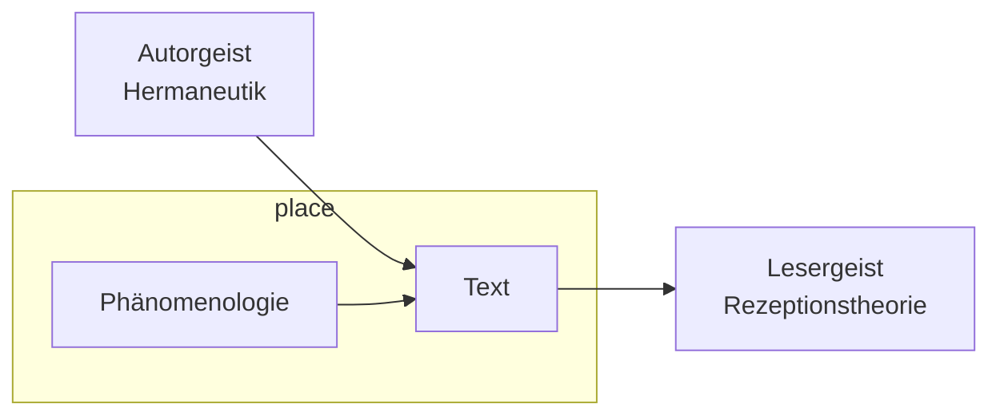

```mermaid
graph LR;
	Autorgeist["`Autorgeist
	Hermaneutik`"]
	
	subgraph ide1 [place]
		Text["`Text`"]
		Phänomenologie
	end
		
	Lesergeist["`Lesergeist
	Rezeptionstheorie`"]

	Autorgeist --> Text --> Lesergeist
	Phänomenologie --> Text
	
```
